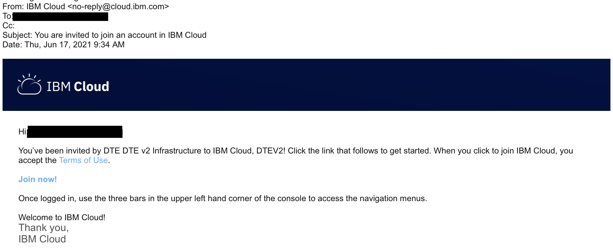
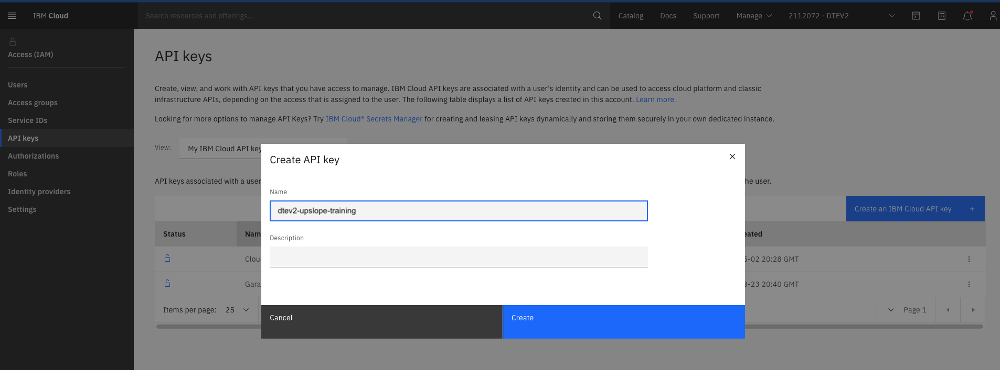

# Computer Setup

Follow the instructions on this page, in order from top to bottom.

## Windows

Complete [Windows setup](./windows.md) instructions and then continue at the "Automatic Install Script" section on the Ubuntu side.

## Mac and Linux

Follow the instructions below.

## Automatic Install Script

Execute the following script in your terminal:

```bash
sh -c "$(curl -fsSL https://raw.githubusercontent.com/upslopeio/ibm-cloud-garage-training/main/computer-setup/setup-mac-linux.sh)"
```

It is safe to run this script multiple times. It will not re-install the tools if they are installed already. Running the script on a healthy setup should complete within a few seconds, and you will essentially just see the results.

If you see any error or experience any problems, have a look at the [Common Issues](#common-issues) section below.

When you are done, post the logged results in the Slack channel thread for the instructor to inspect. [Here](results-example.log) you can find a (rather healthy) example of the results to post. Post the result in any case – even if your output has errors.

Then, continue with [Get an IBM Cloud API Key](#get-an-ibm-cloud-api-key).

#### Common Issues

**IMPORTANT:** Run the setup script again after executing any of the below actions.

- **script doesn't produce any output**
   - configure git email globally: `git config --global user.email <your-github.com-email>`
   - configure git name globally: `git config --global user.name <Your Full Name>`
- **command not found error**
   - run setup script again (multiple time if necessary)
- **docker deamon connect error**
   - start Docker desktop app
- **docker command not found**
   - start Docker desktop app
   - confirm privileged access
- **brew include errors**
   - delete problematic files: `rm -rf /usr/local/include`
- **nvm: command not found**
   - install oh-my-zsh: `sh -c "$(curl -fsSL https://raw.github.com/robbyrussell/oh-my-zsh/master/tools/install.sh)"`
   - restart the terminal

## Get an IBM Cloud API Key

1. Accept your invitation to the "DTETECH" account (in your email)
   
1. Log into https://cloud.ibm.com with your IBM email address
1. ‼️ Make sure that "DTETECH" is selected from the account menu (see below)
1. Click on Manage > Access (IAM)
1. Under "My IBM Cloud API keys" click "View all"
1. Click "Create an IBM Cloud API key"
1. Enter a name and create the key
1. Download the key to your computer (if you don't, you'll have to create another one)





## Login to `ibmcloud` cli

In order to test that your account works, login using your API key.

Replace `YOUR_API_KEY` with your actual API key and then run this command:

```bash
ibmcloud login --apikey <your-api-key> -r us-south
```

Run `ibmcloud ks clusters` to see the list of clusters you can access.

> NOTE: if you are following these instructions before class starts, the cluster list might be empty, and that's OK.

You should see your cohort's cluster in the list.

If you don't, it could be because:

1. It's before class started, and we haven't created it yet
1. You created your API key in the wrong account (your personal account, as opposed to DTETECH)
1. You have not been granted access to the cluster - contact your instructor

## Access the OpenShift Cluster

In order to login to the cluster from the command line, you must first log in on the website.

1. Log into https://cloud.ibm.com with your IBM email address
1. Make sure that "DTETECH" is selected from the account menu
1. Under "Resource Summary" click "Clusters"
1. Click your cohort's cluster
1. Click "OpenShift Web Console"
1. You should see the OpenShift web console


## Configure ICC - fast cluster switcher

1. The automatic setup script downloads `icc` and saves it in `~/.local/bin`. Make sure it is there, if not, run the script again.
1. Run `source ~/.zshrc` to update the path of the current terminal.
1. Run `icc --add-account` - if icc is not found, run the script again and start over at step 1.
1. name the account `garage`
1. Paste in the API key you generated above
1. Run `icc --generate`

When you run `icc` you should see at least one cluster listed (the cluster for your cohort).

When you run `icc <cluster name>` you should not see an error message.

When you run `oc console` you should see the OpenShift Web Console popping up in a new browser tab (this can take up to 10 seconds).

## Visual Studio Code auto save

[Turn on auto save](https://code.visualstudio.com/docs/editor/codebasics#_save-auto-save)


## WebEx

If you haven't already, [Download Webex Meetings](https://www.webex.com/downloads.html)

# Tools

Congratulations! You now have the following tools setup and ready to use:

1. [Brew](https://brew.sh/)
1. [Cloud native toolkit](https://cloudnativetoolkit.dev/setup/fast-start/) (includes `icc`)
1. [Docker Desktop](https://docs.docker.com/get-docker/)
1. [Git](https://git-scm.com/book/en/v2/Getting-Started-Installing-Git)
1. [IBMCloud Plugin: container-service](https://cloud.ibm.com/docs/containers?topic=containers-cs_cli_install)
1. [IBMCloud](https://github.com/IBM-Cloud/ibm-cloud-cli-release/releases/)
1. [icc](../icc)
1. [jq](https://stedolan.github.io/jq/download/)
1. [Kubernetes Tools](https://kubernetes.io/docs/tasks/tools/)
1. [Kustomize](https://kubectl.docs.kubernetes.io/installation/kustomize/)
1. [Node LTS](https://nodejs.org/en/download/)
1. [nvm](https://github.com/nvm-sh/nvm#installing-and-updating)
1. [Tekton](https://github.com/tektoncd/cli)
1. [Visual Studio Code](https://code.visualstudio.com/download)
1. [WebEx](https://www.webex.com/downloads.html)
1. [yq](https://github.com/mikefarah/yq)
