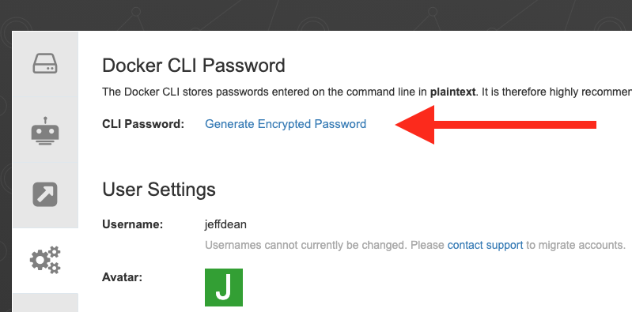
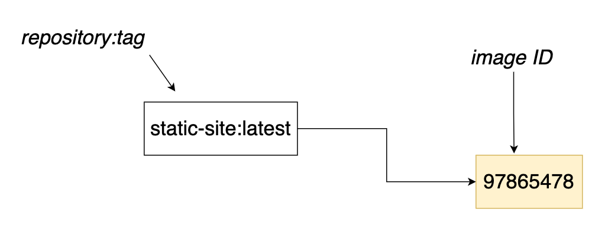
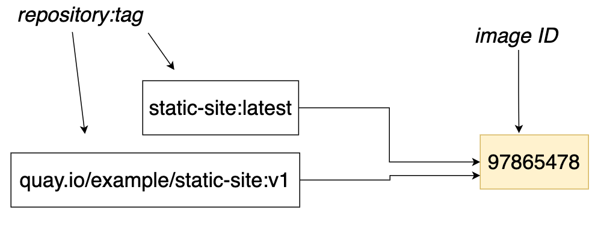

# Docker

## Objectives

By the end of this lesson you should be able to:

- build a docker image from a Dockerfile
- run an image with

## Docker Concepts

**Image**

**Container**

**Image Registry/Image Repository**

## Quay.io

### Create Your Account

You can sign up/sign in with Github or Redhat, or create your account:

1. Visit https://quay.io/signin/
1. Click "Create Account"

### Login From Your Machine

Go to your account settings:


Click "Create Encrypted Password":



Copy the docker login command:


Run that command from your Terminal.

> NOTE: Windows users, do this from the Ubuntu Terminal

### Create a Repository

From the Quay.io dashboard, click "Create New Repository"


Name it `static-site` and make it public:


## Create a local project

```
cd ~
take static-site
code .
```

Add a file named `index.html` with the following contents:

```html
<html>
    <head>
        <title>Static Site</title>
    </head>
    <body>
        <h1>My Static Site</h1>
    </body>
</html>
```

Add a file named `Dockerfile` and add the following contents:

```dockerfile
FROM quay.io/upslopeio/nginx-unprivileged
COPY index.html /usr/share/nginx/html/index.html
```

## Build the image

```
docker build -t static-site .
```

You can see that image now exists on your machine with the following command:

```
docker image ls
```

You have one image on your machine, and one `repository:tag` combination pointing to it:



## Run the image

```
docker run -p 8080:8080 -it static-site
```

Then open the site locally:

http://localhost:8080/

From a different Terminal window you can see that the process is running with the following command:

```
docker ps
```

Use `CTRL+C` to quit the process.

## Push the image to quay.io

First, add a tag to the image (replace USERNAME with your quay.io username):

```
docker tag static-site quay.io/USERNAME/static-site:v1
```

You can see that image now has two tags on your machine:

```
docker image ls
```

Both `repository:tag`s point to the same image ID:



Then push the image to quay.io (replace USERNAME with your quay.io username):

```
docker push quay.io/USERNAME/static-site:v1
```

## Update the image

- Make a change to `index.html`
- Rebuild the image
- Rerun the image to make sure it's working correctly
- Tag the new image with `v2`
- Push the `v2` image to quay.io

## Resources

- https://www.katacoda.com/courses/docker
