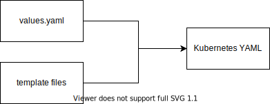

# Helm

Helm is a package manager for Kubernetes. We use two of it's features:

- Generating YAML files from templates
- Having charts that require other charts for Gitops

## Charts

Helm organizes configuration files into folders named Charts. Charts have a few key files:

- **Chart.yaml** which contains metadata about the chart (name etc...)
- **./templates folder** where the templates live
- **values.yaml** a data file containing variables for a particular environment
- **requirements.yaml** - charts can depend on other charts. This file lists those dependencies

## Templates

Instead of having YAML files, Helm uses YAML _templates_. A Helm template file looks like this:

<!-- prettier-ignore-start -->
```yaml
apiVersion: v1
kind: Service
metadata:
  name: {{ include "starter-kit.fullname" . }}
  labels:
    app.kubernetes.io/name: {{ include "starter-kit.name" . }}
    helm.sh/chart: {{ include "starter-kit.chart" . }}
    app.kubernetes.io/instance: {{ .Release.Name }}
    app: {{ .Release.Name }}
spec:
  type: {{ .Values.service.type }}
  ports:
    - port: {{ .Values.service.port }}
      targetPort: {{ .Values.image.port }}
      protocol: TCP
      name: http
  selector:
    app.kubernetes.io/name: {{ include "starter-kit.name" . }}
    app.kubernetes.io/instance: {{ .Release.Name }}
```
<!-- prettier-ignore-end -->

Notice how it's like YAML, but with `{{ }}` placeholders.

Then there's a file named `values.yaml`, which might look like this:

```yaml
global: {}

replicaCount: 1
logLevel: "debug"

image:
  repository: replace
  tag: replace
  pullPolicy: IfNotPresent
  port: 8080
# etc...
```

Helm can generate Kubernetes YAML files by rendering the template using the values from `values.yaml` like so:

```
helm template <release-name> ./path/to/chart
```

This will print YAML to the command line.



## Requirements Files

If a Helm chart has a `requirements.yaml` file, it will look like this:

```yaml
dependencies:
  - name: react-intro
    version: 0.0.1
    repository: >-
      http://artifactory-artifactory.tools:8082/artifactory/generic-local/react-intro-01-dev
```

When a Helm chart is applied, it combines all of the configs from the dependencies, plus any files it has.


## Pre-Built Helm Charts

You can find pre-built Helm charts that work with the IBM Toolkit by going here:

https://github.com/IBM?q=template&type=&language=&sort=

A few common ones are:

- https://github.com/IBM/template-node-react
- https://github.com/IBM/template-node-typescript
- https://github.com/IBM/template-java-spring

Copy the `chart/base` directory and put it in your own React / Java app.
