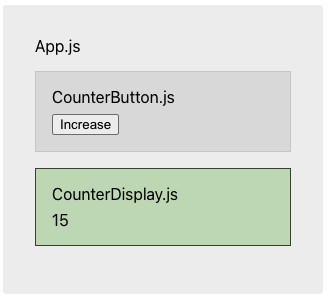

# React Project Cheat Sheet

## React Component Example

The following component shows how to implement a form that adds items to a list:

```js
import React, { useState } from "react";

function App() {
  // define state for the list of books
  const [books, setBooks] = useState([]);

  // define state for the book form
  const [newBook, setNewBook] = useState({ title: "", author: "" });

  // define the function that runs when the form is submitted
  const onSubmit = (e) => {
    e.preventDefault();
    setBooks((books) => [...books, newBook]);
    setNewBook({ title: "", author: "" });
  };

  return (
    <div className="container pt-5">
      <h1>Books</h1>
      <form onSubmit={onSubmit}>
        <p>
          <label htmlFor="title">Title</label>
          <input
            id="title"
            className="form-control"
            type="text"
            name="title"
            value={newBook.title}
            onChange={(e) => setNewBook({ ...newBook, title: e.target.value })}
          />
        </p>
        <p>
          <label htmlFor="author">Author</label>
          <input
            id="author"
            className="form-control"
            type="text"
            name="author"
            value={newBook.author}
            onChange={(e) => setNewBook({ ...newBook, author: e.target.value })}
          />
        </p>
        <button className="btn btn-primary">Add Book</button>
      </form>
      <table className="table table-striped mt-5">
        <tbody>
          {books.map((book, i) => (
            <tr key={i}>
              <td>{book.title}</td>
              <td>{book.author}</td>
            </tr>
          ))}
        </tbody>
      </table>
    </div>
  );
}

export default App;
```

## React Test Example

```js
import { render, screen } from "@testing-library/react";
import App from "./App";
import userEvent from "@testing-library/user-event";

test("allows users to add books", () => {
  render(<App />);

  const titleField = screen.getByLabelText("Title");
  const authorField = screen.getByLabelText("Author");
  userEvent.type(titleField, "Accelerate");
  userEvent.type(authorField, "Jez Humble");
  userEvent.click(screen.getByRole("button"));

  expect(screen.getByText(/Accelerate/)).toBeVisible();
  expect(screen.getByText(/Jez Humble/)).toBeVisible();
});
```

## Code Organization

Very early on, split the app into multiple components.

Your `App.js` file should be thin, like this:

```js
import Deployment from "./Deployments";
import LeadTimes from "./LeadTimes";
import RecoveryTimes from "./RecoveryTimes";

function App() {
  return (
    <div>
      <Deployment />
      <RecoveryTimes />
      <LeadTimes />
    </div>
  );
}

export default App;
```

Then you should have separate files (with their own separate test files) that look like this:

`Deployments.js`

```js
export default function Deployments() {
  return <div></div>;
}
```

`Deployments.test.js`

```js
import { render, screen } from "@testing-library/react";
import Deployments from "./Deployments";
import userEvent from "@testing-library/user-event";

test("allows users to add deployments", () => {
  render(<Deployments />);
  // ...
});
```

## Styling

Add Bootstrap CSS to your application:

1. Go to https://getbootstrap.com/
1. Scroll down to the instructions for "jsDelivr"
1. Copy and paste the `CSS Only` stylesheet to your `public/index.html` page

Example layout:

```html
<div className="row">
  <div className="col">
    <!-- deployments go here -->
    <!-- lead time goes here -->
  </div>
  <div className="col">
    <!-- recovery times go here -->
    <!-- change fail rate goes here -->
  </div>
</div>
```

Whenever the Twitter Bootstrap docs show you `class="something"` in React it needs to be `className="something"` (`class` => `className`).

> NOTE: you may also use a component library like https://react-bootstrap.github.io/

## HTML Date Pickers

To add a Date Picker, use this HTML:

```html
<input type="date" />
```

To add a Time Picker, use this HTML:

```html
<input type="time" />
```

### Testing Date Pickers

The format of the date pickers is important when testing.:

```js
// NOTE the format is YYYY-mm-dd
userEvent.type(dateField, ‘2021-06-29’);
```

The format of the time pickers is also important when testing.

1. You must use 24-hour format (so 1:00pm is `1300`)
1. You may not use seconds (JSDom doesn't support seconds in timepickers)
1. The colon character `:` is optional

```js
userEvent.type(timeField, ‘02:12’);
userEvent.type(timeField, ‘0212’);
```

## Date / Time Formatting

Here are two handy functions you might want for formatting dates and times:

**Pure JS**

```js
function formatDate(date, time) {
  const utcSeconds =
    new Date(...`${date} ${time}`.split(/[- :]/)).getTime() / 1000;
  const d = new Date(0);
  d.setUTCSeconds(utcSeconds);
  d.setMonth(d.getMonth() - 1);
  return d.toLocaleDateString("en-US");
}

function formatTime(date, time) {
  const utcSeconds =
    new Date(...`${date} ${time}`.split(/[- :]/)).getTime() / 1000;
  const d = new Date(0);
  d.setUTCSeconds(utcSeconds);
  return d.toLocaleTimeString("en-US");
}
```

**Libraries**

You can also pull in a library to do the date calculations:

- https://date-fns.org/
  - https://date-fns.org/v2.22.1/docs/format
  - https://date-fns.org/v2.22.1/docs/differenceInCalendarWeeks

## Field Validations

### Handling Form Submission

Make sure that instead of putting an `onClick` event on the button, you put an `onSubmit` on the form.

In the example below, the `createDeployment` function will never be called if the date field isn't filled in.

```jsx
const createDeployment = (e) => {
    e.preventDefault();
};

<form onSubmit={createDeployment}>
    <input type="date" required />
    <button type="submit">
</form>
```

### Required Fields

To make a field required add the `required` attribute to HTML:

```html
<input type="date" required />
```

### Number Fields

To make a number field, use `type="number"` and the `min` and `max` attributes:

```html
<input type="number" required min="1" max="10" />
```

## Working with localStorage

```js
// store an array of objects in localStorage
const data = [
  { name: "Jeff", role: "Instructor" },
  { name: "Abe", role: "Student" },
];
localStorage.setItem("participants", JSON.stringify(data));

// retrieve an array of objects from localStorage
const data = JSON.parse(localStorage.getItem("participants"));
```

## Sharing Data Between Components (Props)

Imagine you have a UI that looks like this:



When you click a button in one component, it has to update a value in a different component.

You can achieve this by:

1. Maintaining state in the parent component
1. Using props to pass the getter/setter of the state

First add a prop to the function definition of the child component:

```js
// the prop here is named onUpdate
CounterButton({onUpdate})
```

In this case `onUpdate` is a function. So in the component you can call the function:

```jsx
function CounterButton({onUpdate}) {
  return (
    <div className="inner">
      CounterButton.js
      <div>
        <button onClick={() => onUpdate(counter => counter + 1)}>
          Increase
        </button>
      </div>
    </div>
  )
}
```

Next, define the prop in the other child component that will read the value:

```js
function CounterDisplay({value}) {
  return (
    <div className="inner inner-2">
      CounterDisplay.js
      <div>{value}</div>
    </div>
  )
}
```

Then, define the state in the parent component, and populate the props:

```jsx
function App() {
  const [counter, setCounter] = useState(0);

  return (
    <div className="outer">
      App.js
      <CounterButton onUpdate={setCounter} />
      <CounterDisplay value={counter} />
    </div>
  );
}
```